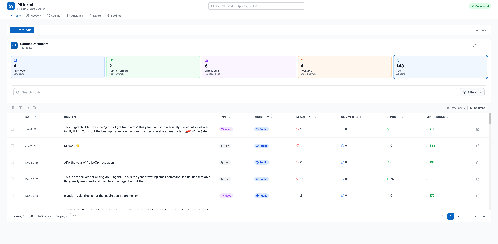
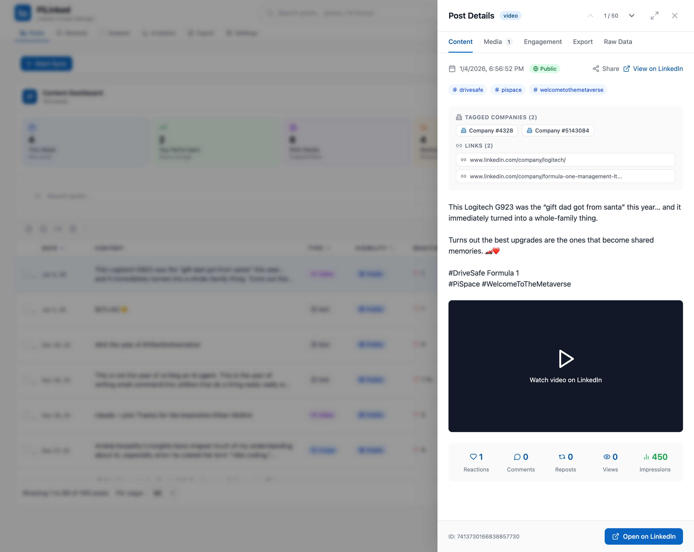
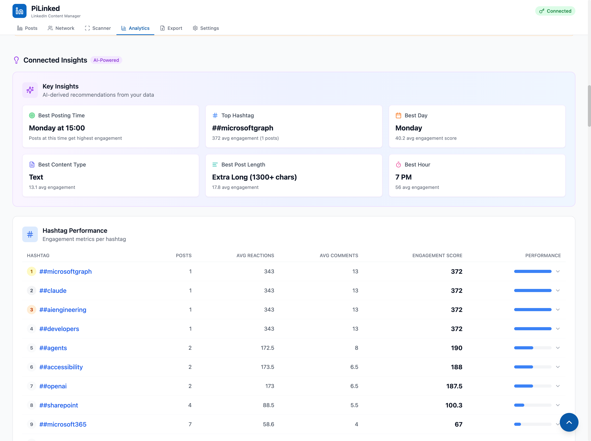
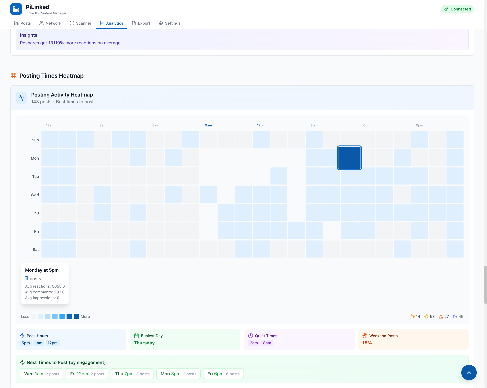
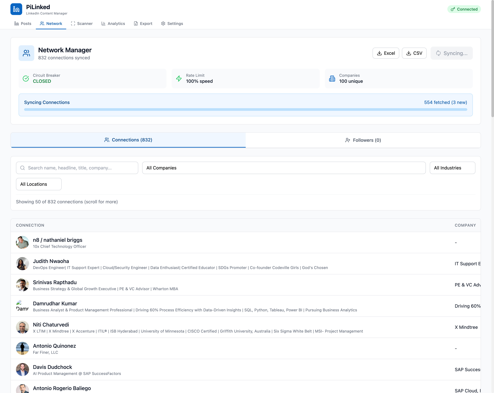
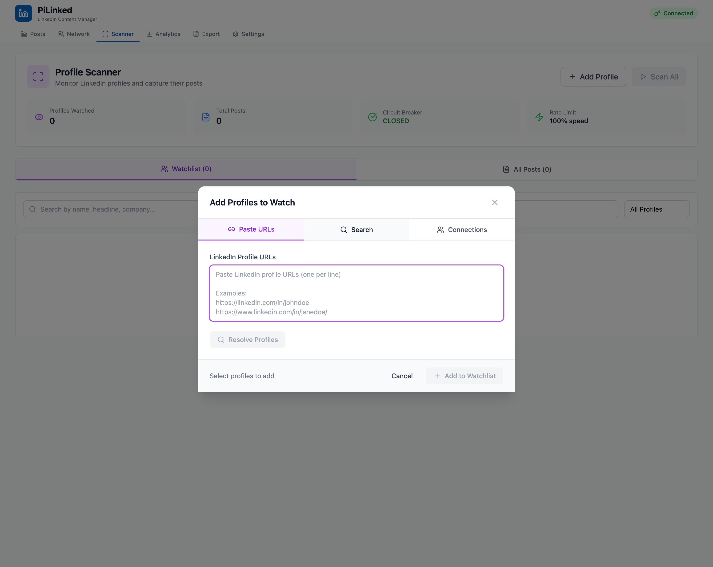
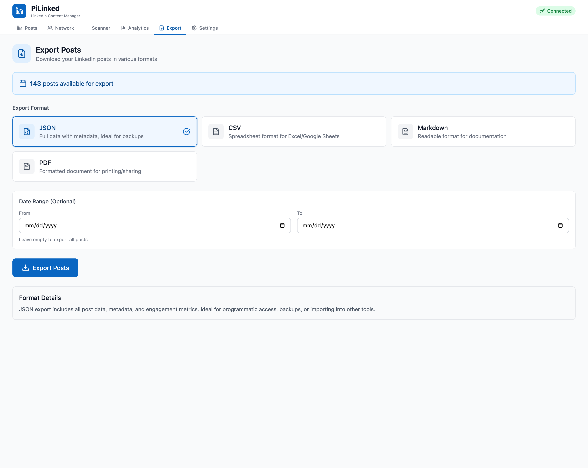
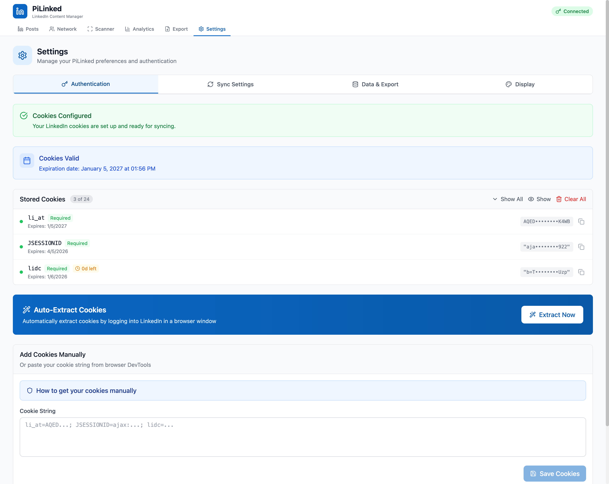

# PiLinked


## Table of Contents

- [Features](#features) — Posts management, analytics, network sync, export
- [Screenshots](#screenshots) — Visual tour of the application
- [Installation](#installation) — Quick start guide
- [Development](#development) — Local setup, project structure
- [Configuration](#configuration) — Authentication, settings
- [API Reference](#api-reference) — Backend endpoints
- [Troubleshooting](#troubleshooting) — Common issues and solutions

---

**PiLinked** is a comprehensive LinkedIn Content Manager that syncs, analyzes, and exports your LinkedIn posts and network data.



### Use Cases

- Archive and backup all your LinkedIn posts locally
- Analyze posting patterns and engagement metrics
- Export posts in multiple formats (JSON, CSV, Markdown, PDF)
- Track connections and network growth
- Monitor other LinkedIn profiles for competitive analysis
- Find optimal posting times based on historical data

### How It Works

1. Add your LinkedIn cookies in Settings
2. Click "Start Sync" to fetch your posts
3. View analytics and insights
4. Export data in your preferred format

No LinkedIn API access required. Works by authenticated cookie-based requests.

---

## Features

### Content Dashboard

View all your LinkedIn posts with rich metadata including engagement metrics, visibility, content type, and more.

```
┌─────────────────────────────────────────────────────────────────┐
│  Content Dashboard                                    143 posts │
├─────────────────────────────────────────────────────────────────┤
│  [4 This Week] [2 Top Performers] [6 With Media] [4 Reshares]  │
├─────────────────────────────────────────────────────────────────┤
│  DATE     │ CONTENT           │ TYPE  │ VISIBILITY │ REACTIONS │
│  Jan 4    │ This Logitech...  │ video │ Public     │ ♥ 1       │
│  Jan 2    │ 6(7)=42 🤔        │ text  │ Public     │ ♥ 1       │
│  Dec 30   │ AKA the year...   │ text  │ Public     │ ♥ 0       │
└─────────────────────────────────────────────────────────────────┘
```

**Features:**
- Sortable columns (date, reactions, comments, impressions)
- Full-text search across all post content
- Advanced filters (date range, type, visibility)
- Column visibility customization
- Pagination with configurable page size
- Click any row to view full post details

### Post Detail View

Click any post to see complete details in a slide-over panel:



| Tab | Contents |
|-----|----------|
| **Content** | Full post text, hashtags, tagged companies, links |
| **Media** | Images, videos, documents attached to post |
| **Engagement** | Reactions breakdown, comments, reposts, views |
| **Export** | Export single post in various formats |
| **Raw Data** | Complete JSON data from LinkedIn |

### AI-Powered Analytics

Get actionable insights from your posting history:



**Key Insights:**
- Best Posting Time (day + hour)
- Top Performing Hashtags
- Optimal Post Length
- Best Day of Week
- Content Type Performance

### Hashtag Performance

Track which hashtags drive the most engagement:

| Rank | Hashtag | Posts | Avg Reactions | Engagement Score |
|------|---------|-------|---------------|------------------|
| 1 | #microsoftgraph | 1 | 343 | 372 |
| 2 | #claude | 1 | 343 | 372 |
| 3 | #aiengineering | 1 | 343 | 372 |

### Posting Activity Heatmap

Visualize when you post and when engagement is highest:



- **Color intensity** = posting frequency
- **Hover** for detailed stats per time slot
- **Peak hours, busiest day, quiet times** at a glance
- **Best times to post** recommendations

### Day of Week Performance

| Day | Posts | Avg Engagement |
|-----|-------|----------------|
| Monday | 11 | 40.2 |
| Thursday | 28 | 15.4 |
| Wednesday | 25 | 14.8 |

### Original vs Reshares Analysis

Compare performance between original content and reshared posts:

- **Original Posts:** 136 (95% of total)
- **Reshares:** 7 (5% of total)
- Insights on which type drives more engagement

### Network Manager

Sync and manage your LinkedIn connections:



**Features:**
- Sync all 1st-degree connections
- Search by name, headline, title, company
- Filter by company and industry
- Export connections to Excel/CSV
- Track follower count over time

**Rate Limiting:**
- Circuit breaker protection
- Configurable sync speed
- Real-time progress tracking

### Profile Scanner

Monitor other LinkedIn profiles and capture their posts:



- Add profiles by URL or search
- Select from your connections
- Batch scan multiple profiles
- Track posts over time
- Competitive analysis ready

### Multi-Format Export

Export your LinkedIn data in various formats:



| Format | Description | Use Case |
|--------|-------------|----------|
| **JSON** | Full data with metadata | Backups, programmatic access |
| **CSV** | Spreadsheet format | Excel/Google Sheets analysis |
| **Markdown** | Readable format | Documentation, blogs |
| **PDF** | Formatted document | Printing, sharing |

**Export Options:**
- Date range filtering
- Selective export (selected posts only)
- Include/exclude metadata

### Cookie Management

Secure authentication via LinkedIn session cookies:



**Features:**
- Auto-extract cookies via browser login
- Manual cookie input support
- Cookie expiration tracking
- Expiration warning banner
- Secure masked display

**Required Cookies:**
- `li_at` - Main authentication token
- `JSESSIONID` - CSRF token source
- `lidc` - Session cookie

### Real-Time Sync

Socket.IO powered real-time updates:

- Live sync progress indicator
- Post count updates as they arrive
- Error notifications
- Circuit breaker status
- Rate limit monitoring

### Keyboard Shortcuts

Power user productivity features:

| Shortcut | Action |
|----------|--------|
| `?` | Show shortcuts help |
| `1-6` | Navigate tabs |
| `/` | Focus search |
| `j/k` | Navigate posts |
| `Enter` | Open post detail |
| `Escape` | Close modal |
| `Ctrl+S` | Start sync |

---

## Screenshots

<details>
<summary>View All Screenshots</summary>

### Posts Table


### Analytics Dashboard


### Engagement Heatmap


### Post Details


### Network Manager


### Export Panel


### Settings


</details>

---

## Installation

### Prerequisites

- Node.js 18+
- npm or yarn
- A LinkedIn account with session cookies

### Quick Start

```bash
# Clone the repository
git clone https://github.com/anthonyrhopkins/PiLinked.git
cd PiLinked

# Start the application (installs dependencies automatically)
./start.sh
```

The start script will:
1. Check and install dependencies if needed
2. Create the data directory
3. Start the backend server (port 3847)
4. Start the frontend dev server (port 5847)
5. Monitor and auto-restart crashed processes

### Access the Application

- **Frontend:** http://localhost:5847
- **Backend API:** http://localhost:3847/api
- **Health Check:** http://localhost:3847/health

### First-Time Setup

1. Open http://localhost:5847
2. Go to **Settings** tab
3. Click **Extract Now** to auto-extract cookies
4. Or paste cookies manually from browser DevTools
5. Return to **Posts** tab
6. Click **Start Sync**

---

## Development

### Project Structure

```
PiLinked/
├── backend/
│   ├── src/
│   │   ├── index.js              # Express server, all API routes
│   │   ├── services/
│   │   │   ├── linkedin-api-service.js   # LinkedIn API interactions
│   │   │   └── token-manager.js          # Cookie management
│   │   └── database/
│   │       └── schema.sql                # SQLite schema
│   └── data/
│       └── pilinked.db                   # SQLite database
├── frontend/
│   ├── src/
│   │   ├── App.jsx               # Main app component
│   │   ├── main.jsx              # Entry point
│   │   ├── components/
│   │   │   ├── PostsTable.jsx    # Posts list with pagination
│   │   │   ├── Analytics.jsx     # Analytics dashboard
│   │   │   ├── ExportPanel.jsx   # Export UI
│   │   │   ├── CookieManager.jsx # Settings page
│   │   │   ├── NetworkManager.jsx # Connections sync
│   │   │   ├── SyncManager.jsx   # Sync controls
│   │   │   └── scanner/
│   │   │       └── ProfileScanner.jsx
│   │   ├── hooks/
│   │   │   ├── useKeyboardShortcuts.js
│   │   │   └── useCookieExpiration.js
│   │   └── stores/
│   │       └── syncStore.js      # Zustand state
│   └── index.html
├── docs/
│   ├── images/                   # Screenshots
│   └── NETWORK-API.md            # API documentation
├── start.sh                      # Development start script
└── package.json
```

### Tech Stack

**Frontend:**
- React 18 with Vite
- TanStack Query (data fetching)
- Zustand (state management)
- Tailwind CSS (styling)
- Recharts (charts)
- Lucide React (icons)
- Socket.IO Client (real-time)

**Backend:**
- Node.js + Express
- Better-SQLite3 (database)
- Socket.IO (WebSockets)
- Node-fetch (API calls)

### Development Commands

```bash
# Start both frontend and backend
./start.sh

# Or start individually:
cd backend && npm run dev
cd frontend && npm run dev

# Build frontend for production
cd frontend && npm run build
```

### Database Schema

```sql
-- Posts table
CREATE TABLE posts (
  id TEXT PRIMARY KEY,
  urn TEXT UNIQUE,
  text TEXT,
  published_at INTEGER,
  visibility TEXT,
  post_type TEXT,
  reactions_count INTEGER,
  comments_count INTEGER,
  reposts_count INTEGER,
  impressions INTEGER,
  -- ... additional fields
);

-- Connections table
CREATE TABLE connections (
  id TEXT PRIMARY KEY,
  name TEXT,
  headline TEXT,
  company TEXT,
  profile_url TEXT,
  synced_at INTEGER
);

-- Followers table
CREATE TABLE followers (
  id TEXT PRIMARY KEY,
  count INTEGER,
  recorded_at INTEGER
);
```

---

## Configuration

### Settings Tabs

| Tab | Purpose |
|-----|---------|
| **Authentication** | Manage LinkedIn cookies |
| **Sync Settings** | Configure sync behavior |
| **Data & Export** | Database management, export options |
| **Display** | UI preferences |

### Environment Variables

The backend can be configured via environment variables:

| Variable | Default | Description |
|----------|---------|-------------|
| `PORT` | 3847 | Backend server port |
| `DATABASE_PATH` | ./data/pilinked.db | SQLite database location |

### Cookie Expiration

LinkedIn cookies typically expire:
- `li_at`: 1 year
- `JSESSIONID`: 3 months
- `lidc`: 24 hours (auto-refreshes)

The app shows warning banners when cookies are:
- Expiring within 24 hours (yellow warning)
- Already expired (red alert)

---

## API Reference

### Posts

| Endpoint | Method | Description |
|----------|--------|-------------|
| `/api/posts` | GET | List posts with pagination |
| `/api/posts/:id` | GET | Get single post |
| `/api/posts/sync` | POST | Trigger post sync |

### Export

| Endpoint | Method | Description |
|----------|--------|-------------|
| `/api/export/json` | GET | Export as JSON |
| `/api/export/csv` | GET | Export as CSV |
| `/api/export/markdown` | GET | Export as Markdown |
| `/api/export/pdf` | GET | Export as PDF |

**Query Parameters:**
- `from` - Start date (Unix timestamp)
- `to` - End date (Unix timestamp)
- `ids` - Comma-separated post IDs

### Connections

| Endpoint | Method | Description |
|----------|--------|-------------|
| `/api/connections` | GET | List connections |
| `/api/connections/sync` | POST | Trigger connection sync |

### Authentication

| Endpoint | Method | Description |
|----------|--------|-------------|
| `/api/auth/status` | GET | Check auth status |
| `/api/auth/cookies` | POST | Save cookies |
| `/api/auth/cookies` | DELETE | Clear cookies |

### Health

| Endpoint | Method | Description |
|----------|--------|-------------|
| `/health` | GET | Server health check |

---

## Troubleshooting

### "Not Connected" status

1. Go to **Settings** > **Authentication**
2. Check if cookies are expired
3. Click **Extract Now** to refresh cookies
4. Alternatively, paste fresh cookies from browser

### Sync stuck or failing

1. Check the **Circuit Breaker** status in Network tab
2. If "OPEN", wait for cooldown or restart the app
3. Check browser console for detailed error messages
4. Verify LinkedIn cookies are valid

### Posts not appearing

1. Ensure sync completed successfully
2. Check the post count in Content Dashboard
3. Clear filters if applied
4. Try refreshing the page

### Rate limiting

LinkedIn has undocumented rate limits. PiLinked includes:
- Automatic rate limit detection
- Circuit breaker pattern (stops after failures)
- Configurable sync speed (100% = fast, lower = safer)

### Database issues

```bash
# Database location
ls -la backend/data/pilinked.db

# Reset database (WARNING: deletes all data)
rm backend/data/pilinked.db
# Restart the app to recreate
```

### Port conflicts

```bash
# Check what's using the ports
lsof -i :3847
lsof -i :5847

# Kill processes
kill -9 <PID>
```

---

## Roadmap

See [PRD-PERFECTION.md](PRD-PERFECTION.md) for the complete roadmap including:

- [ ] Advanced search with filters
- [ ] Selective export for all formats
- [ ] Follower analytics
- [ ] Retry button for failed operations
- [ ] Unified loading states
- [ ] Accessibility improvements

---

## Security Notes

- Cookies are stored locally in SQLite
- No data is sent to external servers
- All LinkedIn communication uses HTTPS
- Cookie values are masked in the UI

**Important:** Never share your `li_at` cookie. It provides full access to your LinkedIn account.

---

## Credits

Built by [@anthonyrhopkins](https://linkedin.com/in/anthonyrhopkins)

## License

MIT License - See LICENSE file for details
